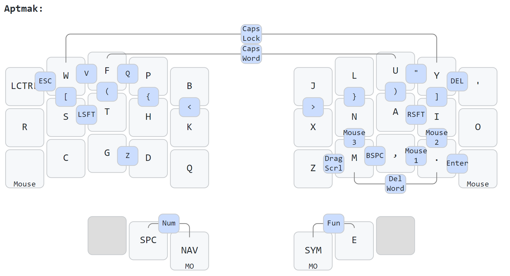

# QMK Keymap

My keymap is based mainly on the [magic sturdy](https://github.com/Ikcelaks/keyboard_layouts/blob/main/magic_sturdy/magic_sturdy.md) layout.


## Inspiration
- https://github.com/pixelbreaker/qmk_userspace
- https://github.com/Ikcelaks/keyboard_layouts/blob/main/magic_sturdy/magic_sturdy.md
- https://github.com/Bertie2011/thrown-exception-keyboard/blob/main/docs/keymap.md
- https://github.com/getreuer/qmk-keymap
- https://www.jonashietala.se/blog/2022/08/28/the_t-342_keyboard_layout/
- https://github.com/possumvibes/keyboard-layout


# Scratchpad!

```
COMB( CMB_EQL,      KC_EQL,            MAGIC, KC_O)
COMB( CMB_MINS,     KC_MINS,           KC_M, KC_C)
COMB( CMB_ESC,      KC_ESC,            HOME_R,   HOME_D)


// COMB( CMB_EXCL,     S(KC_1),          KC_H,   KC_COMM) 
// COMB( CMB_QUEST,    S(KC_SLSH),       KC_DOT, KC_COMM) 

COMB( CMB_NAV,     TG(_NAV),          MAGIC, KC_U, KC_O)  


// this is based on https://www.jonashietala.se/blog/2022/08/28/the_t-342_keyboard_layout/
// COMB( CMB_0,     KC_0,          REPEAT,   KC_H) 
// COMB( CMB_1,     KC_1,          REPEAT,   KC_D) 
// COMB( CMB_2,     KC_2,          REPEAT,   KC_N) 
// COMB( CMB_3,     KC_3,          REPEAT,   KC_R) 
// COMB( CMB_4,     KC_4,          REPEAT,   KC_E) 
// COMB( CMB_5,     KC_5,          REPEAT,   KC_T) 
// COMB( CMB_6,     KC_6,          REPEAT,   KC_A) 
// COMB( CMB_7,     KC_7,          REPEAT,   KC_S) 
// COMB( CMB_8,     KC_8,          REPEAT,   KC_I) 
// COMB( CMB_9,     KC_9,          REPEAT,   KC_G) 

/// the strange combos of https://github.com/alterecco/ahokore-zmk-config/blob/master/config/boards/arm/ahokore/combos.dtsi
COMB( CMB_0,     KC_0,          KC_T,   KC_F) 
COMB( CMB_1,     KC_1,          KC_T,   KC_H) 
COMB( CMB_2,     KC_2,          KC_T,   KC_COMM) 
COMB( CMB_3,     KC_3,          KC_T,   KC_DOT) 
COMB( CMB_4,     KC_4,          KC_T,   KC_N) 
COMB( CMB_5,     KC_5,          KC_T,   KC_A) 
COMB( CMB_6,     KC_6,          KC_T,   KC_E) 
COMB( CMB_7,     KC_7,          KC_T,   MAGIC) 
COMB( CMB_8,     KC_8,          KC_T,   KC_U) 
COMB( CMB_9,     KC_9,          KC_T,   KC_O) 

COMB( CMB_LPAREN,   KC_LPRN,            KC_D,   KC_N) 
COMB( CMB_LCBR,     KC_LCBR,            KC_D,   KC_E) 
COMB( CMB_LBRC,     KC_LBRC,            KC_D,   KC_A) 
COMB( CMB_LT,       KC_LT,              KC_D,   KC_I) 
COMB( CMB_RPAREN,   KC_RPRN,            KC_D,   MAGIC) 
COMB( CMB_RCBR,     KC_RCBR,            KC_D,   KC_U) 
COMB( CMB_RBRC,     KC_RBRC,            KC_D,   KC_O) 
COMB( CMB_GT,       KC_GT,              KC_D,   KC_QUOTE) 

COMB( CMB_TILDE,    KC_TILDE,           KC_R,   KC_F) 
COMB( CMB_COLON,    KC_COLON,           KC_R,   KC_N) 
COMB( CMB_SCLN,     KC_SCLN,            KC_R,   KC_E) 
COMB( CMB_HASH,     KC_HASH,            KC_R,   KC_A) 
COMB( CMB_PERC,     KC_PERC,           KC_R,   KC_I) 
COMB( CMB_CIRC,     KC_CIRC,            KC_R,   MAGIC) 
COMB( CMB_PIPE,     KC_PIPE,            KC_R,   KC_U) 
COMB( CMB_BSLS,     KC_BSLS,            KC_R,   KC_O) 


///

```COMB( CMB_AT,       KC_AT,      OS_LSFT, KC_V)
COMB( CMB_UNDS,     KC_UNDS,    OS_LSFT, KC_M)
COMB( CMB_LBRC,     KC_LBRC,    OS_LSFT, KC_L)
COMB( CMB_RBRC,     KC_RBRC,    OS_LSFT, KC_C)
COMB( CMB_CIRC,     KC_CIRC,    OS_LSFT, KC_P)
COMB( CMB_EXLM,     KC_EXLM,    OS_LSFT, KC_B)
COMB( CMB_LT,       KC_LT,      OS_LSFT, MAGIC)
COMB( CMB_GT,       KC_GT,      OS_LSFT, KC_U)
COMB( CMB_EQL,      KC_EQL,     OS_LSFT, KC_O)
COMB( CMB_AMPR,     KC_AMPR,    OS_LSFT, KC_QUOT)                
COMB( CMB_BSLS,     KC_BSLS,    OS_LSFT, KC_S)
COMB( CMB_SLSH,     KC_SLSH,    OS_LSFT, KC_T)
COMB( CMB_LCBR,     KC_LCBR,    OS_LSFT, KC_R)
COMB( CMB_RCBR,     KC_RCBR,    OS_LSFT, KC_D)
COMB( CMB_ASTR,     KC_ASTR,    OS_LSFT, KC_Y)
COMB( CMB_QUES,     KC_QUES,    OS_LSFT, KC_F)
COMB( CMB_LPRN,     KC_LPRN,    OS_LSFT, KC_N)
COMB( CMB_RPRN,     KC_RPRN,    OS_LSFT, KC_E)
COMB( CMB_MINS,     KC_MINS,    OS_LSFT, KC_A)
COMB( CMB_COLN,     KC_COLN,    OS_LSFT, KC_I)
COMB( CMB_HASH,     KC_HASH,    OS_LSFT, KC_X)
COMB( CMB_DLR,      KC_DLR,     OS_LSFT, KC_K)
COMB( CMB_PIPE,     KC_PIPE,    OS_LSFT, KC_J)
COMB( CMB_TILD,     KC_TILD,    OS_LSFT, KC_G)
COMB( CMB_GRV,      KC_GRV,     OS_LSFT, KC_W)
COMB( CMB_PLUS,     KC_PLUS,    OS_LSFT, KC_Z) 
COMB( CMB_PERC,     KC_PERC,    OS_LSFT, KC_H)
COMB( CMB_DQUO,     KC_DQUO,    OS_LSFT, KC_COMM) 
COMB( CMB_QUOT,     KC_QUOT,    OS_LSFT, KC_DOT) 
COMB( CMB_SCLN,     KC_SCLN,    OS_LSFT, KC_UNDS)        